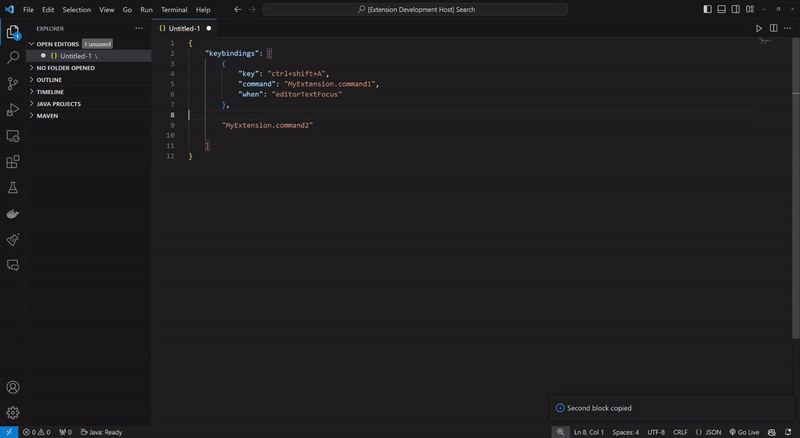

## Copy Paste Plus Plus    

The Copy Paste Plus Plus extension saves you the hassle of copying and pasting blocks of similar data numerous times

## Overview

Copy Paste Plus Plus is a simple extension with 3 total commands.

| Command  | Default Key Binding | Function |
| ------------- | ------------- | ------------- |
| CopyFirst  | Control + Shift + 3  | Copies the upper block for pasting. |
| CopySecond  |  Control + Shift + 4    | Copies the lower block for pasting. |
| PasteGroup  |  Control + Shift + 7    | Pastes content copied in CopyFirst and CopySecond around highlighted text .|

## How to use

First, highlight the upper block you wish to copy and press the keybind for CopyFirst(see default above).

Then, highlight the lower block you wish to copy and press the keybind for CopySecond.

Finally, highlight the block of text you wish to surrond and press the keybind for PasteGroup. Note: also formats the document if possible.

## Issues/Ideas

Please use the issue board [the issue board](https://github.com/dhoss96/CopyPastePlusPlus/issues) for ideas and issues that may arise while using the extension!

## License

[MIT](LICENSE.txt)